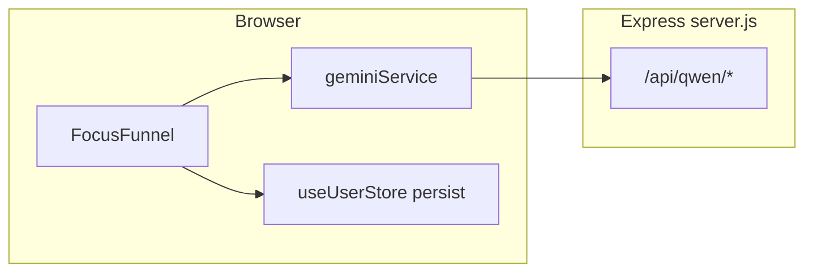

# FocusFunnel 首期：多用户后端与数据库

## 现状（与 FocusFunnel 相关的部分）

- `**[components/FocusFunnel.tsx](d:\self_project\Echo_AIproduct\Echo_web\components\FocusFunnel.tsx)**`：本地状态机（`stage` / `funnelScript` / `selectedIds` 等）+ 调用 `[parseBrainDump](d:\self_project\Echo_AIproduct\Echo_web\services\geminiService.ts)`、`[generateFunnelScript](d:\self_project\Echo_AIproduct\Echo_web\services\geminiService.ts)`（经 Vite 代理到 `[server.js](d:\self_project\Echo_AIproduct\Echo_web\server.js)` 的 `/api/qwen/*`）。
- **持久化**：`[useUserStore](d:\self_project\Echo_AIproduct\Echo_web\store\useUserStore.ts)` 用 Zustand `persist` 写浏览器 `localStorage`（`focusThemes`、`tasks`、每日统计等），**无服务端真相源**。
- **领域模型**：`[types.ts](d:\self_project\Echo_AIproduct\Echo_web\types.ts)` 中的 `Task`、`FocusTheme` 即首期要落库的结构化核心（Funnel 流程中的 `FunnelScript` 多为会话内临时数据，可选是否存审计表）。

你已选择 **多用户 + 数据隔离**，因此所有业务表必须带 `**user_id`**，且 API 必须在认证通过后解析当前用户。

---

## 建议技术选型（可执行、与当前栈兼容）

| 层        | 建议                                                                                                                          |
| -------- | --------------------------------------------------------------------------------------------------------------------------- |
| 数据库      | **PostgreSQL**（本地 Docker 或托管实例）；若希望更快起步可用 **Supabase**（PG + 自带 Auth，但会绑定供应商）                                                |
| ORM / 迁移 | **Prisma** 或 **Drizzle**（二选一，与 `server.js` 同仓库、脚本跑 migrate）                                                                 |
| 认证       | **邮箱+密码** 或 **Magic link** 的 JWT（Access + Refresh）或 **HttpOnly Session Cookie**；在 Express 中加 `auth` 中间件，`req.userId` 注入下游路由 |
| 密码       | `bcrypt` / `argon2`，禁止明文                                                                                                    |

不在此计划内强制具体库名，但表设计按 PG 语义描述。

---

## 数据模型（FocusFunnel 首期最小集）

1. `**users`**：`id`, `email`（唯一）, `password_hash`, `created_at`
2. `**sessions` 或 `refresh_tokens`**（若用 JWT 刷新）：`user_id`, `token_hash`, `expires_at`（按所选方案二选一）
3. `**focus_themes`**：`id`, `user_id`, `intent`（枚举字符串）, `tags`（`text[]` 或 JSON）, `is_primary`, `updated_at`
4. `**tasks`**：`id`, `user_id`, 与 `[Task](d:\self_project\Echo_AIproduct\Echo_web\types.ts)` 对齐的列或 **JSONB `payload`**（首期可用 JSONB 减少与前端频繁改字段的迁移成本，后续再规范化）

**可选（第二期或同一期末尾）**：`funnel_runs` — 存 `user_id`, `input_hash` 或脱敏摘要、`is_subsequent`, `script`（`FunnelScript` JSON）、`created_at`，用于排错与产品分析，**不要存完整明文 brain dump** 除非有明确合规与加密策略。

---

## API 设计（REST 示例）

- `**POST /api/auth/register`** / `**POST /api/auth/login`** / `**POST /api/auth/logout`**（或 refresh）
- `**GET /api/me`**：返回当前用户基本信息
- `**GET /api/focus-themes`** / `**PUT /api/focus-themes`**（整表替换或 PATCH 单条，与 `[setFocusThemes](d:\self_project\Echo_AIproduct\Echo_web\store\useUserStore.ts)` 行为对齐即可）
- `**GET /api/tasks`** / `**PUT /api/tasks**`（全量同步）或 `**PATCH /api/tasks/:id**`（若你希望减少冲突，可后续再做）

所有路由除 register/login 外：**校验会话/JWT**，并 `**WHERE user_id = req.userId`**。

---

## 前端改造顺序（与 FocusFunnel 对齐）

1. **新增 `services/apiClient.ts`**（或类似）：`fetch` 基址、`Authorization` 头、401 处理。
2. **登录/注册 UI**：最小页面或 Modal（可放在 `[App.tsx](d:\self_project\Echo_AIproduct\Echo_web\App.tsx)` 外层 gating）。
3. **登录成功后**：用 API **拉取** `focusThemes` + `tasks` 写入 Zustand；**写操作**（`setTasks` / `setFocusThemes`）改为 debounce 或显式「保存」调用 `PUT`（避免每个 keystroke 打 API）。
4. **FocusFunnel**：逻辑可基本不动；确保 `parseBrainDump` / `generateFunnelScript` 使用的 `focusThemes`、icebox 任务来自已与服务器同步的 store（或传入前先从 store 读取最新）。
5. `**persist` 策略**：多用户下建议 **降级为仅缓存 UI 偏好** 或 **按 userId 分 key 的本地缓存**，避免用户 A 登出后用户 B 读到 A 的 `localStorage`。

---

## 安全与运维（与本期强相关）

- **环境变量**：`DATABASE_URL`、JWT secret / session secret；沿用现有 `[.env.example](d:\self_project\Echo_AIproduct\Echo_web\.env.example)` 模式，**勿提交密钥**。
- **CORS**：生产环境收紧为前端域名；开发保留 `localhost`。
- **Qwen Key**：仍只放在服务端（当前已满足）；若未来把 `parseBrainDump` 移到服务端，可隐藏 prompt 与业务数据不出浏览器。

---

## 建议实施顺序（里程碑）

1. 选 ORM + 建库 + 迁移脚本 + `users` 表
2. 实现注册/登录 + 认证中间件
3. `focus_themes` + `tasks` 的 CRUD/sync API + Postman/脚本自测
4. 前端接入 auth + 同步 `focusThemes`/`tasks`
5. 手工走通 **FocusFunnel 全流程**（brain dump → preview → funnel → 写回 tasks）
6. （可选）`funnel_runs` 审计表与只读查询 API

---

## 明确延后到其他模块的内容

- **每日重置、通勤统计、森林节点**（仍在 `useUserStore`）：可作为下一模块「Timeline / Compass / Forest」再扩展表结构。  
- **把 LLM 从浏览器迁到专用服务端路由**：可独立 PR，不阻塞「任务+主题持久化」。

